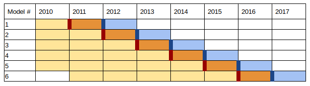

# Triage

## ETL

DT sent a dump of their databases related to inspections
( *fiscalización* ) and  about *materias*.

The DT’s dump contains information about the inspections in two stages:

- When the inspection is requested ( *ingreso de la fiscalización* )
- When the inspection is concluded ( *informe de la fiscalización* )

The dump was uploaded to the `raw` schema in our database. We also
included some other (mostly public) datasets:

- Codes for economic activity (**cae**)
- Codes and description about the *comunas*
- Inspector’s office data
- Chile’s macroeconomic activity per month
- Daily copper prices
- Public tax data about the companies (remember a company has many
  *facilities* and the inspection happen  at  the *facility*, we use
  this mainly for record linking).
- Companies’ addresses (you can download it from
  [here](https://github.com/dssg/direccion_trabajo_inspections/blob/master/www.sii.cl/estadisticas/nominas/nominapersonasjuridicas.htm))

From `raw` we cleaned all these tables and generate cleaned tables in
the `cleaned` schema. The cleaning process was related to join tables
that were related (e.g. we had a tax table per year in `raw` and join
them in just one tax table in `cleaned`). Lower case for the `text`
fields, removed row with missing identifiers (e.g. no `RUT`, no
address, etc).

Finally, in order to simplify the interaction with `triage` we
generated a `semantic` schema. This schema de-normalizes the tables in
`cleaned` and generates tables that describes semantic objects:
*companies*, *facilities*, *workers* (when the inspection is reactive
the workers request the inspection), *inspectors*, *DT offices*. The
schema also contains tables describing the semantic events:
*inspections* (a inspection row contains information about the
request -if any- and the result of the inspection) and *materias*.
The following figure shows the semantic schema’s ERD.

The semantic tables will be used by `triage` to generate the features
and train the models.

## Experiment definition file

Here, we will explain the [inspections_01.yaml](./inspections_01.yaml) experiment’s definition file.

### What is the temporal structure of your problem? (`temporal_config`)

Given the temporal dependency of our data, we will use *Temporal
Cross-validation*, (**TCV**) instead of *k-fold cross-validation*. The following
image shows how **TCV** splits the dataset:

*Figure. Train model to predict failed inspection in the dark orange cell at
as of date (dark red rectangle) using data from the yellow cells.
Test trained model bt predicting failed inspection in the light blue
cells at as of date (dark blue rectangle)*

We want to explore a big grid, so, as a first step, we will generate
predictions every year (`test_durations` +
`model_update_frequency`). For the generation of labels and features
we
will use the whole data set, from January 2010 to the
December  2017. We will update ( *retrain* ) the models every
year (`model_update_frequency`). Each row of the training/testing
matrices will be facility - year
(i.e. one row per year per facility in the cohort)
(`training_as_of_date_frequencies`,
`test_as_of_date_frequencies`). The label temporal
span in both, training and testing is 1 year
(`training_label_timespans`, `test_label_timespans`).

### Which are the entities of interest? (`cohort_config`)

Only **active** companies will be included in the train/test
matrices. A company is **active** if it has tax data reported in that year.

### What do we want to predict? Which is the label? (`label_config`)

#### If you are predicting inspections

If the company was inspected in the temporal interval defined  between the day of
prediction and the label temporal span, it will have a positive label,
if not the company will have a negative label.

#### If you are predicting infractions

If you want to predict if the inspector will find an infraction
(experiment file: [infractions_01.yaml](./insfractions_01.yaml)) you
need to change the `label_config`. First you need to see the result of
the inspection, if the inspection failed the facility will have a
positive label, if the facility passed the inspection, then a negative
label. What happen if the facility wasn’t inspected? In that case, for
the training matrices, the facility/company won’t be included, in testing
matrices those facilites/companies will be included with a `NULL` label.

### What features do we want to use? (`feature_aggregations`)

 Defines feature groups (`prefix`) and individual
 features for experiment. For each feature group, a SQL query is
 provided that defines the from obj, a SQL object from which the
 individual features are calculated. For each individual feature, the
 aggregation (eg. `max`, `avg`) and strategy for imputing missing values
 is defined. For each feature group, a list of time intervals for
 aggregation is defined. These time intervals define how far back from
 the as-of-date we look to calculate features (e.g. *number of times  that the facility was inspected in the last 2 years*)

### Which models do you want to try? Which metrics? (`grid_config` and  `scoring`)

Defines the set of classifiers and hyperparameters that the experiment
will search over.

`scoring` defines the set of metrics that will be calculated for
training and testing. Includes set of metrics (eg. `precision@`) and
thresholds (eg. `10%`).

### Others

## Index of experiments

We are including four different experiment configuration files.

- [test](https://github.com/dssg/direccion_trabajo_inspections/blob/master/experiments/test.yaml)
  A very simple experiment, small cohort, small grid model, just to
  test that everything works. You can start here and then add
  complexity, if you like.
- [inspections](https://github.com/dssg/direccion_trabajo_inspections/raw/master/experiments/inspections_01.yaml)
  We try to model the Pr(inspection) part with this experiment
  (Basically learn the inspector’s behavior). The
  cohort in this case is the *company* instead of the *facility*. Our
  assumption was that the probability of being inspected depends on
  the *company*. This is a simplifying assumption. You could modify
  the cohort and do it at the *facility* level also. The label also
  changes: *Will be this company (any of their facilities) being
  inspected in the following month?*
- [infractions](https://github.com/dssg/direccion_trabajo_inspections/raw/master/experiments/infractions_01.yaml)
  In this experiment we try learn Pr(infraction|inspection). The main
  changes are (1) the cohort (now we are using *facilities*, not
  *companies*) (2) the label: *Will be this facility have an infraction
  found status if inspected the next month?*
- [fines](https://github.com/dssg/direccion_trabajo_inspections/raw/master/experiments/fines_01.yaml)
  This experiment has a non actionable label: *Will be this facility
  fined if inspected the next month?* It is non actionable because DT
  don’t want to reduce *fines* but *infractions* i.e. DT tries to
  protect the workers, not generate revenue. Also, some companies
  actually *prefer* to be fined instead of *fix* the infraction.
